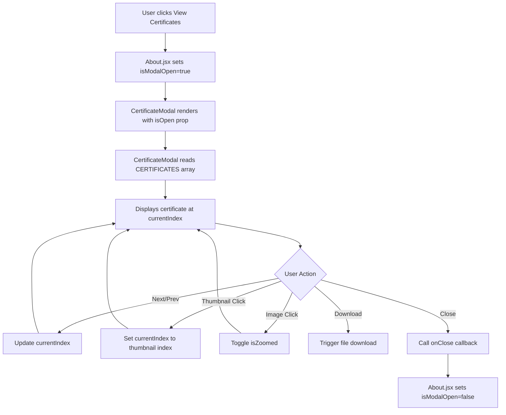

# Design Document: Certificate Modal Gallery

## Overview

The Certificate Modal Gallery is a React-based interactive component that displays professional certificates in a modal overlay with navigation, zoom, and download capabilities. This feature integrates with the existing portfolio's About page, allowing visitors to browse through 10 converted certificate images with a polished user experience.

### Key Features

- **Modal-based gallery**: Full-screen overlay with certificate display
- **Navigation controls**: Previous/next buttons with wrap-around behavior
- **Thumbnail navigation**: Quick-access thumbnail strip for direct certificate selection
- **Zoom functionality**: Click-to-enlarge feature for detailed certificate inspection
- **Download capability**: One-click download of individual certificates
- **Responsive design**: Optimized layouts for desktop, tablet, and mobile devices
- **Accessibility**: Full keyboard support and ARIA labels for assistive technologies

### Technology Stack

- **React 19.1.1**: Component framework with hooks for state management
- **React Icons 5.5.0**: Icon library for UI elements (FaCertificate, FaTimes, FaChevronLeft, FaChevronRight, FaDownload)
- **CSS3**: Styling with CSS variables, animations, and media queries
- **Vite**: Build tool and development server
- **Vitest + React Testing Library**: Testing framework for unit and property-based tests
- **fast-check 4.8.0**: Property-based testing library

## Architecture

### Component Structure

```
About.jsx (Container)
├── CertificateModal (Presentation Component)
│   ├── Modal Header
│   │   ├── Certificate Info (title, issuer, date)
│   │   └── Close Button
│   ├── Image Container
│   │   ├── Certificate Image (with zoom)
│   │   └── Zoom Hint (conditional)
│   ├── Modal Footer
│   │   ├── Navigation Controls (prev/next/counter)
│   │   └── Download Button
│   └── Thumbnail Strip (conditional, if > 1 cert)
└── View Certificates Button (trigger)
```

### State Management

The application uses React hooks for state management:

**About.jsx (Parent Component)**:
- `isModalOpen`: Boolean state tracking modal visibility
- Passes `isModalOpen` and `setIsModalOpen` (via onClose callback) to CertificateModal

**CertificateModal.jsx (Child Component)**:
- `currentIndex`: Integer tracking the currently displayed certificate (0-based)
- `isZoomed`: Boolean tracking zoom state for the current certificate image

### Data Flow



### File Structure

```
src/
├── Pages/
│   └── About.jsx                    # Container component with modal trigger
├── Components/
│   ├── CertificateModal.jsx         # Modal gallery component
│   └── CertificateModal.css         # Modal styling
public/
└── certificates/                     # Certificate image storage
    ├── udacity-react-1.jpg
    ├── udacity-react-2.jpg
    ├── dbu-course-1.jpg
    ├── dbu-course-2.jpg
    ├── dbu-course-3.jpg
    ├── dbu-course-4.jpg
    ├── dbu-course-5.jpg
    ├── dbu-course-6.jpg
    ├── dbu-course-7.jpg
    └── dbu-certificate-main.jpg
```

## Components and Interfaces

### CertificateModal Component

**Props Interface**:
```typescript
interface CertificateModalProps {
  isOpen: boolean;           // Controls modal visibility
  onClose: () => void;       // Callback to close modal
}
```

**CERTIFICATES Array Structure**:
```typescript
interface Certificate {
  id: number;               // Unique sequential identifier
  title: string;            // Certificate display title
  filename: string;         // Image filename in /public/certificates/
  issuer: string;           // Issuing organization
  date: string;             // Issue date or year
}

const CERTIFICATES: Certificate[] = [
  {
    id: 1,
    title: "Udacity React Nanodegree - Part 1",
    filename: "udacity-react-1.jpg",
    issuer: "Udacity",
    date: "2023"
  },
  // ... 9 more certificates
];
```

**State Interface**:
```typescript
interface CertificateModalState {
  currentIndex: number;     // Current certificate index (0-based)
  isZoomed: boolean;        // Zoom state for current image
}
```

### About Component Integration

**Updated About.jsx State**:
```typescript
interface AboutState {
  skillsVisible: boolean;    // Existing: controls skill bar animations
  isModalOpen: boolean;      // NEW: controls certificate modal visibility
}
```

**Button Placement**:
The "View Certificates" button will be placed immediately after the existing "Download CV" button in the about-text section, maintaining consistent styling with the `btn` and `btn-secondary` classes.

### Event Handlers

**CertificateModal Event Handlers**:
- `goToNext()`: Increment currentIndex with wrap-around, reset zoom
- `goToPrev()`: Decrement currentIndex with wrap-around, reset zoom
- `handleDownload()`: Create temporary anchor element, trigger download
- `handleEsc(e)`: Close modal on Escape key press
- `setCurrentIndex(index)`: Set specific certificate by thumbnail click
- `setIsZoomed(prev => !prev)`: Toggle zoom state on image click

**About.jsx Event Handlers**:
- `handleOpenModal()`: Set isModalOpen to true
- `handleCloseModal()`: Set isModalOpen to false

## Data Models

### Certificate Data Model

```javascript
const CERTIFICATES = [
  {
    id: 1,
    title: "Udacity React Nanodegree - Part 1",
    filename: "udacity-react-1.jpg",
    issuer: "Udacity",
    date: "2023"
  },
  {
    id: 2,
    title: "Udacity React Nanodegree - Part 2",
    filename: "udacity-react-2.jpg",
    issuer: "Udacity",
    date: "2023"
  },
  {
    id: 3,
    title: "DBU Software Development Course 1",
    filename: "dbu-course-1.jpg",
    issuer: "Debre Birhan University",
    date: "2022"
  },
  {
    id: 4,
    title: "DBU Software Development Course 2",
    filename: "dbu-course-2.jpg",
    issuer: "Debre Birhan University",
    date: "2022"
  },
  {
    id: 5,
    title: "DBU Software Development Course 3",
    filename: "dbu-course-3.jpg",
    issuer: "Debre Birhan University",
    date: "2022"
  },
  {
    id: 6,
    title: "DBU Software Development Course 4",
    filename: "dbu-course-4.jpg",
    issuer: "Debre Birhan University",
    date: "2022"
  },
  {
    id: 7,
    title: "DBU Software Development Course 5",
    filename: "dbu-course-5.jpg",
    issuer: "Debre Birhan University",
    date: "2023"
  },
  {
    id: 8,
    title: "DBU Software Development Course 6",
    filename: "dbu-course-6.jpg",
    issuer: "Debre Birhan University",
    date: "2023"
  },
  {
    id: 9,
    title: "DBU Software Development Course 7",
    filename: "dbu-course-7.jpg",
    issuer: "Debre Birhan University",
    date: "2023"
  },
  {
    id: 10,
    title: "Amanuale Gezahegn Professional Certificate",
    filename: "dbu-certificate-main.jpg",
    issuer: "Debre Birhan University",
    date: "2023"
  }
];
```

### CSS Custom Properties

The modal styling relies on existing CSS variables from the portfolio theme:

```css
--card-bg: Background color for modal container
--text-primary: Primary text color
--text-secondary: Secondary/muted text color
--border-color: Border color for separators
--accent: Accent color for buttons and highlights
--accent-hover: Hover state for accent elements
--accent-rgb: RGB values for accent with opacity
--radius-sm: Small border radius (buttons)
--radius-md: Medium border radius (images, download button)
--radius-lg: Large border radius (modal container)
--radius-full: Full border radius (999px for pills)
```

## Error Handling

### Image Loading Failures

**Problem**: Certificate images may fail to load due to missing files, incorrect paths, or network issues.

**Solution**: Implement onError handlers with SVG placeholders

**Main Certificate Image Error Handler**:
```javascript
onError={(e) => {
  e.target.src = "data:image/svg+xml,%3Csvg xmlns='http://www.w3.org/2000/svg' width='400' height='300'%3E%3Crect width='400' height='300' fill='%23333'/%3E%3Ctext x='50%25' y='50%25' text-anchor='middle' fill='%23999' font-size='16' font-family='sans-serif'%3ECertificate Image Not Found%3C/text%3E%3Ctext x='50%25' y='60%25' text-anchor='middle' fill='%23666' font-size='12' font-family='monospace'%3E" + currentCert.filename + "%3C/text%3E%3C/svg%3E";
}}
```

**Thumbnail Image Error Handler**:
```javascript
onError={(e) => {
  e.target.src = "data:image/svg+xml,%3Csvg xmlns='http://www.w3.org/2000/svg' width='80' height='60'%3E%3Crect width='80' height='60' fill='%23333'/%3E%3C/svg%3E";
}}
```

**Behavior**:
- Displays a neutral gray placeholder with error message
- For main images: shows filename for debugging
- For thumbnails: shows simple gray rectangle
- Modal remains functional and navigable even with missing images

### Download Failures

**Problem**: Download may fail due to file permissions, browser restrictions, or CORS issues.

**Current Implementation**: Basic download via temporary anchor element

**Potential Issues**:
- Cross-origin restrictions if certificates are served from a different domain
- Browser popup blockers may prevent download
- Mobile browsers may have different download behaviors

**Mitigation**:
- Serve certificates from the same origin (/public/certificates/)
- Use direct file references (no external URLs)
- Test across multiple browsers and devices

### Empty Certificate Array

**Problem**: CERTIFICATES array might be empty or have a single item.

**Solution**: Conditional rendering and disabled states

```javascript
// Thumbnail strip only renders if > 1 certificate
{CERTIFICATES.length > 1 && (
  <div className="thumbnail-strip">
    {/* thumbnails */}
  </div>
)}

// Navigation buttons disabled if <= 1 certificate
disabled={CERTIFICATES.length <= 1}
```

### Modal State Cleanup

**Problem**: Modal effects (body scroll lock, event listeners) must be cleaned up to prevent memory leaks.

**Solution**: useEffect cleanup function

```javascript
useEffect(() => {
  const handleEsc = (e) => {
    if (e.key === "Escape") onClose();
  };
  if (isOpen) {
    document.addEventListener("keydown", handleEsc);
    document.body.style.overflow = "hidden";
  }
  return () => {
    document.removeEventListener("keydown", handleEsc);
    document.body.style.overflow = "unset";
  };
}, [isOpen, onClose]);
```

## Testing Strategy

### Unit Testing Approach

Unit tests will verify specific behaviors, edge cases, and component interactions using React Testing Library and Vitest.

**Unit Test Categories**:

1. **Component Rendering Tests**:
   - Modal renders when isOpen is true
   - Modal does not render when isOpen is false
   - All UI elements render correctly (header, footer, navigation, thumbnails)
   - Certificate info displays correctly (title, issuer, date)

2. **User Interaction Tests**:
   - Clicking "View Certificates" button opens modal
   - Clicking close button closes modal
   - Clicking overlay closes modal
   - Escape key closes modal
   - Next button increments to next certificate
   - Previous button decrements to previous certificate
   - Thumbnail click navigates to specific certificate
   - Image click toggles zoom state
   - Download button triggers download action

3. **Edge Case Tests**:
   - First certificate wraps to last when clicking previous
   - Last certificate wraps to first when clicking next
   - Navigation resets zoom state
   - Empty CERTIFICATES array disables navigation
   - Single certificate hides thumbnail strip and disables navigation
   - Missing image files display placeholder
   - Thumbnail images display placeholder on error

4. **Accessibility Tests**:
   - Close button has aria-label
   - Navigation buttons have aria-labels
   - Download button has aria-label
   - Body scroll is locked when modal is open
   - Body scroll is restored when modal closes

5. **Responsive Behavior Tests**:
   - Modal layout adapts to viewport size (tested via window.innerWidth mocking)
   - CSS classes apply correctly for mobile breakpoints

### Property-Based Testing (PBT) Assessment

**Is PBT appropriate for this feature?**

This feature is primarily a **UI component with side effects** (DOM manipulation, file downloads, modal state). Most requirements involve:
- UI rendering and layout (modal display, responsive design)
- Browser interactions (clicks, keyboard events, downloads)
- Side effects (scroll locking, event listeners)
- Component lifecycle management

**PBT Applicability Analysis**:
- ❌ No pure functions with clear input/output transformation
- ❌ No parsers, serializers, or data transformations
- ❌ No algorithms or business logic suitable for universal properties
- ✅ Some stateful behavior could use PBT (navigation wrap-around, index calculations)

**Decision**: PBT is **marginally applicable** but **not strongly recommended** for this feature. The navigation logic has testable properties, but the rest of the feature is better suited to example-based unit tests.

**If PBT is implemented**, it should focus on:
- Navigation index calculations (wrap-around behavior)
- State transitions (zoom reset on navigation)

**However**, these behaviors are simple enough that example-based tests provide sufficient coverage with less complexity. Therefore, **this design will omit the Correctness Properties section** and focus on comprehensive unit and integration testing instead.

### Testing Configuration

**Test Framework**: Vitest with React Testing Library
**Coverage Target**: 80%+ line coverage for CertificateModal and About components

**Test File Structure**:
```
src/
├── Components/
│   ├── CertificateModal.test.jsx        # Component unit tests
│   └── CertificateModal.jsx
├── Pages/
│   └── About.test.jsx                   # Integration tests with modal
```

**Example Unit Test**:
```javascript
import { render, screen, fireEvent } from '@testing-library/react';
import { describe, it, expect, vi } from 'vitest';
import CertificateModal from './CertificateModal';

describe('CertificateModal', () => {
  it('should wrap to first certificate when clicking next on last certificate', () => {
    const onClose = vi.fn();
    render(<CertificateModal isOpen={true} onClose={onClose} />);
    
    // Navigate to last certificate
    const nextBtn = screen.getByLabelText('Next certificate');
    for (let i = 0; i < 9; i++) {
      fireEvent.click(nextBtn);
    }
    
    // Verify we're on certificate 10/10
    expect(screen.getByText('10 / 10')).toBeInTheDocument();
    
    // Click next, should wrap to 1
    fireEvent.click(nextBtn);
    expect(screen.getByText('1 / 10')).toBeInTheDocument();
  });
  
  it('should display placeholder when image fails to load', () => {
    const onClose = vi.fn();
    render(<CertificateModal isOpen={true} onClose={onClose} />);
    
    const img = screen.getByAltText(/certificate/i);
    fireEvent.error(img);
    
    // Verify placeholder SVG was set
    expect(img.src).toContain('data:image/svg+xml');
    expect(img.src).toContain('Certificate Image Not Found');
  });
});
```

### Integration Testing

**Integration Test Scenarios**:
- About page renders View Certificates button
- Clicking button opens CertificateModal
- Modal displays certificates from CERTIFICATES array
- Modal closes and returns focus to About page
- Multiple open/close cycles work correctly

### Manual Testing Checklist

**Desktop Testing**:
- [ ] Modal opens smoothly with animation
- [ ] All navigation controls work correctly
- [ ] Zoom functionality enlarges images properly
- [ ] Download initiates file save
- [ ] Thumbnails display and are clickable
- [ ] Escape key closes modal
- [ ] Overlay click closes modal

**Mobile Testing** (< 768px):
- [ ] Modal fills viewport appropriately
- [ ] Navigation controls stack vertically
- [ ] Download button expands to full width
- [ ] Thumbnails are scrollable horizontally
- [ ] Touch events work correctly
- [ ] No horizontal overflow issues

**Accessibility Testing**:
- [ ] Screen reader announces modal opening
- [ ] All buttons have descriptive labels
- [ ] Keyboard navigation works (Tab, Escape)
- [ ] Focus management is correct
- [ ] Color contrast meets WCAG AA standards

**Cross-Browser Testing**:
- [ ] Chrome/Edge
- [ ] Firefox
- [ ] Safari
- [ ] Mobile Safari (iOS)
- [ ] Chrome Mobile (Android)

